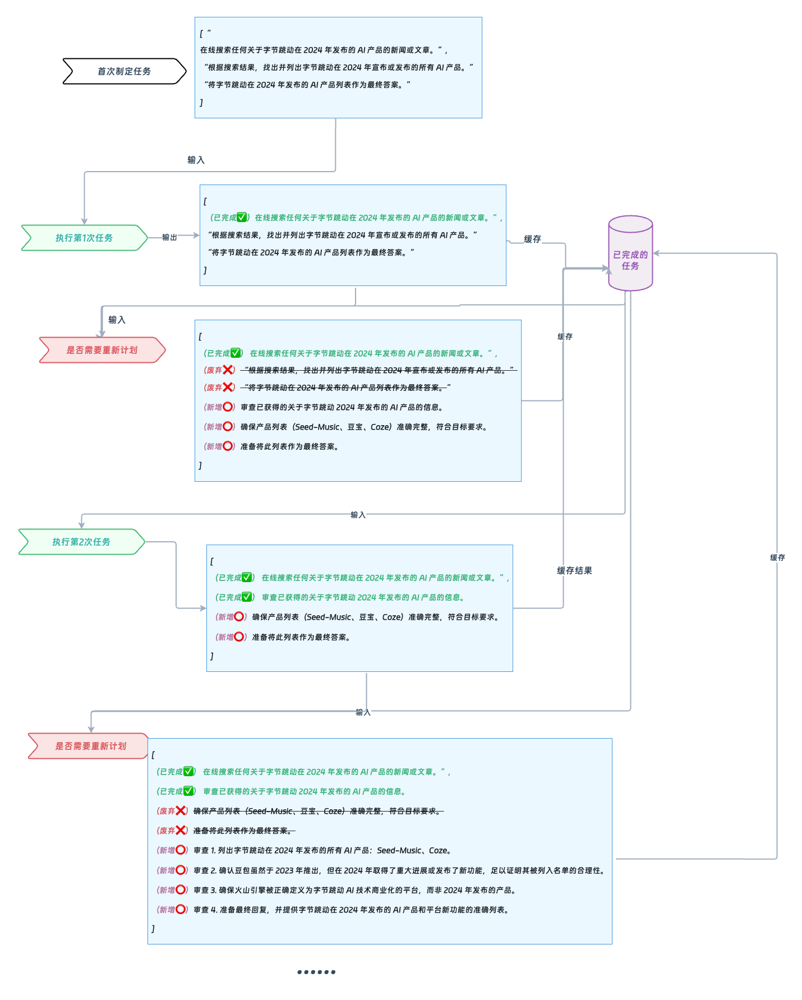

搜索的过程:


### 开始

input: 2024 年字节跳动发布的 AI 产品有哪些?
output: Planner 任务定义 列出了对应的任务

```
[
  "Search online for any news or articles about ByteDance AI products released in 2024.",
  "Identify and list all the AI products ByteDance has announced or released in 2024 based on the search results.",
  "Present the list of ByteDance AI products released in 2024 as the final answer."
]
```

### 执行第 1 次任务

input: Search online for any news or articles about ByteDance AI products released in 2024.
output: 搜索到的结果
此时 pastSteps 存储了第一次计划的结果

```
[
  "Search online for any news or articles about ByteDance AI products released in 2024."
  // ... 结果
]
```

### replaner 检查 是否需要优化任务

input: 已完成的任务 + 待执行的计划

```
  plan: [
    'Identify and list all the AI products ByteDance has announced or released in 2024 based on the search results.',
    'Present the list of ByteDance AI products released in 2024 as the final answer.'
  ],
  pastSteps: [
    [
      'Search online for any news or articles about ByteDance AI products released in 2024.',
      'Here is some information about ByteDance AI products released in 2024:\n' +
        '\n' +
        "1. **Seed-Music**: ByteDance's primary AI music generation model, Seed-Music, was unveiled in September 2024. This model plays a significant role in ByteDance's growing AI capabilities and ecosystem.\n" +
        '\n' +
        "2. **Doubao**: Initially launched publicly in August 2023, Doubao is a highly popular AI chatbot in China, becoming a blockbuster with its advanced features. It's part of ByteDance's series of language learning models (LLMs).\n" +
        '\n' +
        "3. **Coze**: Launched in early 2024, Coze provides a user-friendly drag-and-drop interface that allows for the integration of advanced language models, including Doubao, as well as models from OpenAI and Anthropic. This platform is available for businesses and developers through the Volcano Engine, which commercializes ByteDance's AI models.\n" +
        '\n' +
        'For more detailed information, you can read the full article on [Recode China AI](https://recodechinaai.substack.com/p/tiktoks-parent-bytedance-quietly).'
    
    ]
  ],
```

output: 列举出来了

```
[
  "Review the information obtained about ByteDance AI products released in 2024.",
  "Ensure the list of products (Seed-Music, Doubao, Coze) is accurate and complete as per the objective.",
  "Prepare to present this list as the final answer."
]
```

### 执行第 2 次任务

input: Review the information obtained about ByteDance AI products released in 2024.
output:

```
  pastSteps: [
   //... 执行的任务执行结果
    [
      'Review the information obtained about ByteDance AI products released in 2024.',
      'In 2024, ByteDance released a variety of AI products and platforms that showcase their advancements in artificial intelligence technology:\n' +
        '\n' +
        "1. **Seed-Music**: This is ByteDance's primary AI music generation model, which was unveiled in September 2024. It's part of ByteDance’s efforts to enhance their app ecosystem, focusing on integrating AI models.\n" +
        '\n' +
        '2. **Doubao**: Though initially launched in August 2023, Doubao gained significant traction and became a blockbuster AI chatbot in China by 2024. This chatbot is part of the Doubao brand name, which also includes ByteDance’s large language models (LLMs).\n' +
        '\n' +
        "3. **Coze**: Introduced in early 2024, Coze is a platform that provides a user-friendly, drag-and-drop interface. It allows users to integrate advanced language models, including ByteDance's Doubao series as well as models from OpenAI and Anthropic. This product is aimed at simplifying the use and integration of language models in various applications.\n" +
        '\n' +
        "4. **Volcano Engine**: This platform commercializes many of ByteDance’s AI models, offering them as on-demand APIs or platforms for businesses and developers. It underscores ByteDance's strategy to make their AI technologies more accessible and applicable to business needs.\n" +
        '\n' +
        'Overall, ByteDance continues to build a robust AI ecosystem, focusing on multimodal AI and enhancing their product offerings for both end-users and business applications.'
    ]
  ],
```

### replaner 检查 是否需要优化任务

input: 已完成的任务 + 待执行的计划

```
  plan: [
    'Ensure the list of products (Seed-Music, Doubao, Coze) is accurate and complete as per the objective.',
    'Prepare to present this list as the final answer.'
  ],
  pastSteps: [
    [
      'Search online for any news or articles about ByteDance AI products released in 2024.',
    //....
    ],
    [
      'Review the information obtained about ByteDance AI products released in 2024.',
      // ....
  ],
```

output: 对于剩余的任务 进一步优化
```
 steps: [
    '1. List all AI products released by ByteDance in 2024: Seed-Music, Coze.',
    '2. Confirm that Doubao, although launched in 2023, had significant developments or releases in 2024 that justify its inclusion in the list.',
    '3. Ensure that Volcano Engine is correctly characterized as a platform that commercializes ByteDance’s AI technologies rather than a product released in 2024.',
    '4. Prepare the final response with the accurate list of AI products and platforms New feature releases by ByteDance in 2024.'
  ]
```

### 执行第 3 次任务
input: 1. List all AI products released by ByteDance in 2024: Seed-Music, Coze.
output:

```
 pastSteps: [
   // ... 之前的任务执行结果
    [
      '1. List all AI products released by ByteDance in 2024: Seed-Music, Coze.',
      'In 2024, ByteDance released the following AI products:\n' +
        '\n' +
        "1. **Seed-Music**: This is ByteDance's primary AI music generation model, officially unveiled in September 2024. Seed-Music provides features like controllable music generation, score-to-music, lyrics and music editing, and zero-shot voice cloning, covering multiple creative tasks suitable for both music novices and professional musicians.\n" +
        '\n' +
        `2. **Coze**: Launched in early 2024, Coze is an AI agent platform offering a user-friendly interface with a drag-and-drop feature. It allows integration with advanced language models, including ByteDance's Doubao series and models from OpenAI and Anthropic. Coze functions by executing tasks based on user input, designed to facilitate human-agent collaboration and is often compared to an "inexperienced intern" due to its iterative feedback processes.\n` +
        '\n' +
        "Both of these products demonstrate ByteDance's continuous efforts to integrate and enhance AI technology across different domains."
    ]
  ],
```


### replaner 检查 是否需要优化任务

output: 再一步优化剩余的步骤
```
  steps: [
    'Verify the information accuracy about ByteDance AI products released in 2024 from multiple sources to ensure the products listed are correct and complete.',
    'Check for any additional products or updates to AI products by ByteDance in 2024 to ensure all relevant releases are included.',
    'Finalize the response with a complete and verified list of AI products released by ByteDance in 2024.'
  ]
```

### 执行第 4 次任务

input: Verify the information accuracy about ByteDance AI products released in 2024 from multiple sources to ensure the products listed are correct and complete. 
output: 

```
 pastSteps: [
   // ... 之前的任务执行结果
      [
      'Verify the information accuracy about ByteDance AI products released in 2024 from multiple sources to ensure the products listed are correct and complete.',
      'Based on the information from multiple sources, here are the verified AI products released by ByteDance in 2024:\n' +
        '\n' +
        '1. **Seed-Music**: A primary AI music generation model launched by ByteDance in September 2024. It aims to enhance music creation through AI.\n' +
        '\n' +
        "2. **Coze**: Launched in early 2024, Coze provides a user-friendly interface featuring drag-and-drop capabilities, allowing users to integrate advanced language models such as ByteDance's Doubao series, as well as models from OpenAI and Anthropic.\n" +
        '\n' +
        '3. **Doubao**: Although it was publicly launched in August 2023, the Doubao series continued to grow in 2024, becoming a prominent AI chatbot in China.\n' +
        '\n' +
        "These products illustrate ByteDance's focused advancement in AI technology in 2024, enhancing its ecosystem in both consumer and enterprise applications."
    ]
  ],

```

### replaner 检查 是否需要优化任务

output: 再一步优化剩余的步骤
```
 [
    'Summarize the verified information about AI products released by ByteDance in 2024.',
    'Provide the summary to the user as the final response.'
  ]
```

### 执行第 5 次任务
input: Summarize the verified information about AI products released by ByteDance in 2024. 
output:

```

pastSteps: [
  // ... 之前的任务执行结果
     [
      'Summarize the verified information about AI products released by ByteDance in 2024.',
      'In 2024, ByteDance released several AI products, indicating a significant expansion of its AI capabilities:\n' +
        '\n' +
        '1. **Coze**: Launched in early 2024, Coze provides a user-friendly interface with drag-and-drop features, allowing for the integration of advanced language models. This includes ByteDance’s own Doubao series and models from other sources like OpenAI and Anthropic.\n' +
        '\n' +
        "2. **Doubao**: Originally launched in August 2023, it continued to be a blockbuster AI chatbot in China in 2024, driving ByteDance's growth in AI applications.\n" +
        '\n' +
        '3. **Seed-Music**: This AI music generation model was unveiled in September 2024, marking ByteDance’s expansion into AI-driven music production.\n' +
        '\n' +
        '4. **Development with Huawei Chips**: ByteDance plans to develop a new AI model primarily using chips from Huawei, reflecting a shift towards domestic suppliers for AI hardware due to international trade restrictions.\n' +
        '\n' +
        "These developments reflect ByteDance's strategic focus on advancing AI technologies and products across different sectors, including music, chatbots, and hardware-optimized AI models."
    ]
  ],

```

### replaner 执行最后总结任务，返回最终结果
input: 执行最后一个任务进行总结
```
  plan: [ 'Provide the summary to the user as the final response.' ],
```
output: 总结结果

```
 'In 2024, ByteDance launched several AI products, highlighting their focus on enhancing artificial intelligence capabilities:\n' +
      '\n' +
      "1. **Seed-Music**: Released in September 2024, this is ByteDance's primary AI music generation model, designed to facilitate music creation and editing for both amateurs and professionals.\n" +
      '\n' +
      "2. **Coze**: Introduced in early 2024, this platform offers a drag-and-drop interface for integrating advanced language models, including ByteDance's own Doubao series and models from OpenAI and Anthropic.\n" +
      '\n' +
      "3. **Doubao**: Initially launched in August 2023, Doubao remained a leading AI chatbot in 2024, significantly contributing to ByteDance's AI initiatives in China.\n" +
      '\n' +
      "These products reflect ByteDance's commitment to building a robust AI ecosystem across various applications, from music production to conversational agents."
  }
```